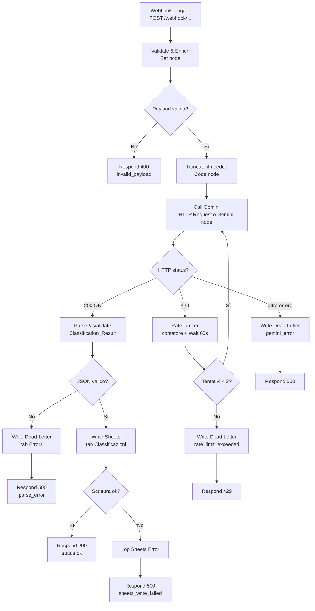

# Design Document — webhook-gemini-classifier

## Overview

Il workflow `webhook-gemini-classifier` è un'automazione n8n che espone un endpoint HTTP webhook, classifica il payload JSON ricevuto tramite Google Gemini, e persiste il risultato su Google Sheets. Gestisce in modo esplicito rate limiting (429), errori non recuperabili (dead-letter row su tab separato), e rispetta il modello di risposta sincrona dei webhook n8n.

Il workflow si inserisce nella collezione `n8n-automation-lab` come cartella `05-webhook-gemini-classifier` — il quinto elemento della progressione per complessità, classificato **⚡⚡⚡⚡ Esperto** per l'introduzione di: retry loop con contatore, gestione errori multi-livello, response mode sincrono, e branch paralleli con dead-letter queue su Sheets.

### Obiettivo tecnico primario

Trasformare un payload JSON arbitrario in una riga strutturata su Google Sheets con categoria, confidenza e sommario — in modo affidabile anche sotto condizioni di errore e throttling da parte di Gemini.

---

## Architecture

### Modello di esecuzione n8n

Il webhook n8n in **response mode sincrono** (modalità "Last Node") trattiene la risposta HTTP al client fino al completamento del workflow o al timeout di 30 secondi. Questo obbliga a strutturare il flusso come una pipeline lineare con branch di errore espliciti che terminano ciascuno con un nodo **Respond to Webhook**.

### Flusso principale ad alto livello



### Struttura dei nodi n8n

Il workflow è composto da **4 macro-componenti**:

| Componente | Nodi n8n | Responsabilità |
|---|---|---|
| **Ingestion layer** | Webhook Trigger, Set (Enrich), Code (Validate) | Ricezione, enrichment timestamp, validazione e troncamento payload |
| **Classifier** | HTTP Request (Gemini) o Google Gemini node | Invio a Gemini, ricezione `Classification_Result` |
| **Rate Limiter** | If (check tentativi), Wait (60s), Set (increment counter) | Gestione 429 con max 3 retry |
| **Writer layer** | Google Sheets (tab Classificazioni), Google Sheets (tab Errors), Respond to Webhook (×N) | Persistenza risultato, dead-letter, risposta HTTP |

---

## Components and Interfaces

### 1. Webhook_Trigger

**Tipo nodo:** `n8n-nodes-base.webhook`

**Configurazione:**
- HTTP Method: `POST`
- Response Mode: `responseNode` (Last Node — risposta gestita da nodi "Respond to Webhook" a valle)
- Path: generato automaticamente da n8n all'importazione

**Output verso nodo successivo:** `$json.body` contiene il payload deserializzato da n8n.

**Gestione errori nativi n8n:**
- Corpo non-JSON: n8n restituisce automaticamente 400 prima di raggiungere il workflow se il body non è parsabile (dipende dalla versione n8n; in alternativa, il Code node di validazione intercetta `null`/`undefined`).
- Metodo non POST: configurabile tramite il campo `HTTP Method` — n8n risponde 405 per metodi non configurati.
- Content-Type non `application/json`: gestito nel Code node di validazione.

> **Nota implementativa:** n8n non espone nativamente un controllo sul `Content-Type` nel nodo Webhook. Il controllo va implementato nel primo Code node leggendo `$json.headers['content-type']`.

---

### 2. Set node — Enrich

**Tipo nodo:** `n8n-nodes-base.set`

**Funzione:** Aggiunge `received_at` (ISO 8601 UTC) al payload prima di qualsiasi elaborazione.

**Campi impostati:**

| Campo | Valore | Note |
|---|---|---|
| `received_at` | `{{ $now.toISO() }}` | Timestamp arrivo richiesta |
| `retry_count` | `0` | Contatore per il rate limiter |

---

### 3. Code node — Validate & Truncate

**Tipo nodo:** `n8n-nodes-base.code`  
**Linguaggio:** JavaScript

**Responsabilità:**
1. Controllare che `Content-Type` sia `application/json` → se no, uscita sul branch errore con `{ statusCode: 415 }`.
2. Controllare che il body sia un oggetto JSON (non `null`, non stringa) → se no, branch errore 400.
3. Serializzare il payload; se supera 10.000 caratteri, troncare e impostare `truncated: true`.
4. Passare a valle il payload arricchito con `received_at`, `retry_count`, `truncated`.

**Output shape:**
```json
{
  "payload": { ...original or truncated... },
  "payload_raw": "<JSON string, max 10000 chars>",
  "received_at": "2025-01-01T12:00:00.000Z",
  "retry_count": 0,
  "truncated": false
}
```

---

### 4. HTTP Request node — Classifier (Gemini)

**Tipo nodo:** `n8n-nodes-base.httpRequest`  
**Credenziale:** Google Gemini (PaLM API) configurata in n8n

> Il workflow usa il nodo HTTP Request con credenziale Google Gemini (PaLM API) piuttosto che il nodo LangChain Google Gemini, per avere controllo diretto sullo status code HTTP della risposta (necessario per intercettare 429).

**Endpoint:** `https://generativelanguage.googleapis.com/v1beta/models/gemini-pro:generateContent`

**Prompt di sistema (incluso nel body):**

```
Sei un classificatore JSON. Analizza il payload che ti viene fornito e rispondi ESCLUSIVAMENTE con un oggetto JSON valido nel seguente formato, senza testo aggiuntivo, senza markdown, senza backtick:
{"category": "<una tra: informational, transactional, error, alert, other>", "confidence": <float 0.0-1.0>, "summary": "<max 200 caratteri>"}
```

**Body della richiesta (template):**
```json
{
  "contents": [{
    "parts": [{
      "text": "{{ $json.payload_raw }}"
    }]
  }],
  "systemInstruction": {
    "parts": [{ "text": "<prompt di sistema>" }]
  }
}
```

**Timeout:** 30 secondi (configurato nel nodo).

**Gestione status code:** Il nodo è configurato con `Continue on Fail: true` per catturare 429 e altri errori HTTP senza interrompere il workflow. Lo status viene letto nel nodo If successivo tramite `$json.error.httpCode` o `$response.statusCode`.

---

### 5. If node — Route by Status

**Tipo nodo:** `n8n-nodes-base.if`

Tre branch:

| Branch | Condizione | Destinazione |
|---|---|---|
| `200 OK` | `$json.candidates` esiste | Code node: Parse Response |
| `429` | `$json.error.code === 429` | Set node: Increment Counter |
| `altro` | fallback | Sheets Writer: Dead Letter |

---

### 6. Code node — Parse Classification Result

Estrae da `$json.candidates[0].content.parts[0].text` il JSON prodotto da Gemini.

**Validazioni:**
- `category` è uno tra: `informational`, `transactional`, `error`, `alert`, `other`
- `confidence` è un numero tra 0 e 1
- `summary` è una stringa di massimo 200 caratteri

Se la validazione fallisce → branch errore con `category: "parse_error"`.

---

### 7. Rate Limiter — Set + If + Wait

**Set node — Increment Counter:**
- `retry_count`: `{{ $json.retry_count + 1 }}`

**If node — Check Retry Limit:**
- Condizione: `retry_count < 3` → ritorna al Classifier
- Else → branch dead-letter con `category: "rate_limit_exceeded"`

**Wait node:**
- Durata: 60 secondi (fixed)
- Posizionato tra il Set Increment e il ritorno al Classifier

---

### 8. Google Sheets node — Writer (tab Classificazioni)

**Tipo nodo:** `n8n-nodes-base.googleSheets`  
**Operazione:** `appendOrUpdate` → `Append Row`  
**Credenziale:** Google OAuth2

**Colonne scritte (in ordine):**

| Colonna | Valore | Tipo |
|---|---|---|
| `timestamp` | `{{ $json.received_at }}` | String (ISO 8601) |
| `category` | `{{ $json.category }}` | String |
| `confidence` | `{{ $json.confidence }}` | Number |
| `summary` | `{{ $json.summary }}` | String |
| `payload_raw` | `{{ $json.payload_raw }}` | String (JSON, max 10000 char) |
| `truncated` | `{{ $json.truncated }}` | Boolean |

**Placeholder:** `YOUR_SPREADSHEET_ID` (sostituire prima dell'uso).

---

### 9. Google Sheets node — Dead Letter Writer (tab Errors)

**Operazione:** Append Row sul tab `Errors`

**Colonne scritte:**

| Colonna | Valore |
|---|---|
| `timestamp` | ISO 8601 corrente |
| `error_type` | `"parse_error"` / `"rate_limit_exceeded"` / `"gemini_error"` / `"sheets_write_failed"` |
| `error_message` | Messaggio di errore |
| `payload_raw` | Payload originale (max 5000 caratteri) |

---

### 10. Respond to Webhook nodes

Un nodo per ciascun percorso di uscita:

| Nodo | HTTP Status | Body |
|---|---|---|
| Respond 200 | 200 | `{"status":"ok","category":"<val>","confidence":<val>}` |
| Respond 400 | 400 | `{"error":"invalid_payload","detail":"<msg>"}` |
| Respond 415 | 415 | `{"error":"unsupported_media_type"}` |
| Respond 429 | 429 | `{"error":"rate_limit_exceeded"}` |
| Respond 500 (parse) | 500 | `{"error":"parse_error"}` |
| Respond 500 (sheets) | 500 | `{"error":"sheets_write_failed"}` |
| Respond 500 (gemini) | 500 | `{"error":"gemini_error"}` |

---

## Data Models

### Payload in ingresso (arbitrario)

Il workflow accetta qualsiasi oggetto JSON valido. Non esiste schema fisso. Esempi rappresentativi:

```json
// Evento transazionale
{ "event": "purchase", "user_id": "u123", "amount": 49.99, "currency": "EUR" }

// Payload vuoto (valido, classificato come "other")
{}

// Evento di errore applicativo
{ "level": "error", "msg": "NullPointerException", "service": "payments", "ts": 1700000000 }
```

---

### Classification_Result (output Gemini)

```json
{
  "category": "transactional",
  "confidence": 0.92,
  "summary": "Purchase event for user u123, amount 49.99 EUR."
}
```

**Vincoli di validità:**
- `category`: uno tra `informational | transactional | error | alert | other`
- `confidence`: float `[0.0, 1.0]`
- `summary`: stringa, max 200 caratteri

---

### Riga su tab Classificazioni (Google Sheets)

| Campo | Tipo | Vincolo |
|---|---|---|
| `timestamp` | String | ISO 8601 UTC |
| `category` | String | enum: 5 valori |
| `confidence` | Number | [0.0, 1.0] |
| `summary` | String | max 200 char |
| `payload_raw` | String | max 10.000 char, JSON serializzato |
| `truncated` | Boolean | true se payload > 10.000 char |

---

### Dead_Letter_Row (tab Errors)

| Campo | Tipo | Vincolo |
|---|---|---|
| `timestamp` | String | ISO 8601 UTC |
| `error_type` | String | enum: parse_error, rate_limit_exceeded, gemini_error, sheets_write_failed |
| `error_message` | String | testo libero |
| `payload_raw` | String | max 5.000 char |

---

### Risposta HTTP al client

**Successo:**
```json
{ "status": "ok", "category": "transactional", "confidence": 0.92 }
```

**Errore:**
```json
{ "error": "invalid_payload", "detail": "Body is not valid JSON" }
```

---

### Stato interno del workflow (variabili di esecuzione)

```json
{
  "payload": {},
  "payload_raw": "<string>",
  "received_at": "<ISO string>",
  "retry_count": 0,
  "truncated": false
}
```

`retry_count` è incrementato ad ogni 429 e confrontato nel If node del rate limiter. Viene inizializzato a `0` nel Set node di enrichment all'ingresso del workflow.

---

## Correctness Properties

*A property is a characteristic or behavior that should hold true across all valid executions of a system — essentially, a formal statement about what the system should do. Properties serve as the bridge between human-readable specifications and machine-verifiable correctness guarantees.*

---

### Property 1: Payload JSON valido passato invariato

*For any* oggetto JSON ben formato ricevuto via POST con `Content-Type: application/json`, il corpo estratto dal Webhook_Trigger e passato al nodo successivo deve essere semanticamente identico all'input originale (stessi campi, stessi valori, stessa struttura).

**Validates: Requirements 1.2, 2.1**

---

### Property 2: Payload non-JSON produce sempre HTTP 400

*For any* stringa che non è un JSON valido (testo libero, HTML, XML, stringa vuota, stringa null), inviata come corpo di una richiesta POST, la risposta HTTP deve essere sempre 400 con body contenente `{"error": "invalid_payload"}`.

**Validates: Requirements 1.3, 2.2**

---

### Property 3: Content-Type non JSON produce sempre HTTP 415

*For any* valore di `Content-Type` diverso da `application/json` (es. `text/plain`, `multipart/form-data`, `application/xml`, header assente), la risposta HTTP deve essere sempre 415 con body `{"error": "unsupported_media_type"}`.

**Validates: Requirements 1.6**

---

### Property 4: Payload grande è sempre troncato a 10.000 caratteri e truncated riflette la realtà

*For any* payload JSON la cui serializzazione supera 10.000 caratteri, la stringa `payload_raw` inviata a Gemini deve avere lunghezza ≤ 10.000, e il campo `truncated` della riga scritta su Sheets deve essere `true`. *For any* payload la cui serializzazione è ≤ 10.000 caratteri, `truncated` deve essere `false`.

**Validates: Requirements 2.4, 2.5**

---

### Property 5: received_at è sempre presente e in formato ISO 8601

*For any* richiesta HTTP ricevuta, il campo `received_at` aggiunto al payload deve essere sempre presente, non nullo, e deve essere parsabile come data ISO 8601 valida.

**Validates: Requirements 2.6**

---

### Property 6: Parsing della risposta Gemini è un round-trip fedele

*For any* risposta Gemini mock contenente un JSON valido con i campi `category` (uno dei 5 valori attesi), `confidence` (float [0, 1]) e `summary` (stringa ≤ 200 caratteri), il `Classification_Result` estratto dal Code node di parsing deve contenere esattamente gli stessi valori dell'oggetto sorgente.

*For any* risposta Gemini mock che non contiene JSON parsabile oppure contiene campi fuori specifica, il risultato deve essere una dead-letter row con `error_type: "parse_error"` e il payload originale nel campo `payload_raw`.

**Validates: Requirements 3.3, 3.4**

---

### Property 7: Rate limiting — massimo 3 retry e intervallo minimo 60 secondi

*For any* sequenza di risposte 429 da Gemini, il workflow deve ritentare la chiamata per un massimo di 3 volte, con un intervallo di attesa di almeno 60 secondi tra ogni tentativo fallito, e deve terminare con una dead-letter row avente `error_type: "rate_limit_exceeded"` se tutti e 3 i tentativi esauriscono senza successo.

**Validates: Requirements 4.1, 4.2, 4.3**

---

### Property 8: Happy path — riga Sheets completa e risposta 200 corretta

*For any* `Classification_Result` valido prodotto da Gemini, la riga scritta sul tab `Classificazioni` deve contenere esattamente i 6 campi specificati (`timestamp`, `category`, `confidence`, `summary`, `payload_raw`, `truncated`) con i tipi e i valori corretti, e la risposta HTTP al client deve essere 200 con body contenente `status: "ok"`, `category` e `confidence` corrispondenti al `Classification_Result`.

**Validates: Requirements 5.1, 5.2, 5.5**

---

### Property 9: Routing degli errori — codice HTTP corrisponde sempre alla causa

*For any* tipo di errore che si verifica durante l'esecuzione del workflow, il codice HTTP della risposta al client deve corrispondere alla causa: 400 per payload non valido, 415 per Content-Type non supportato, 429 per rate limit esaurito, 500 per errori di sistema (parsing Gemini fallito, scrittura Sheets fallita, errore generico Gemini). La dead-letter row associata deve contenere sempre `timestamp`, `error_type`, `error_message` e `payload_raw` (max 5.000 caratteri).

**Validates: Requirements 5.4, 6.2, 6.4**

---

## Error Handling

### Strategia generale

Il workflow adotta il pattern **fail-fast con risposta garantita**: ogni branch di errore termina con un nodo `Respond to Webhook` dedicato. Il client riceve sempre una risposta entro 30 secondi (o 10 secondi per errori rilevati tardi nel flusso).

### Gerarchia degli errori

```
Livello 1 — Validazione input (gestito pre-Gemini)
  → 400: payload non-JSON o malformato
  → 415: Content-Type non application/json
  → 405: metodo HTTP non POST

Livello 2 — Rate limiting Gemini (gestito nel loop)
  → Retry automatico fino a 3 volte con gap 60s
  → Fallout: 429 + dead-letter su tab Errors

Livello 3 — Risposta Gemini non valida (gestito nel Parse node)
  → Dead-letter su tab Errors con error_type: parse_error
  → Risposta 500 al client

Livello 4 — Scrittura Sheets fallita (gestito post-classificazione)
  → Log nei log n8n
  → Risposta 500 con {"error": "sheets_write_failed"}

Livello 5 — Fallback globale (Error connector su nodi critici)
  → Dead-letter su tab Errors se raggiungibile
  → Fallback: log interno n8n se Sheets non raggiungibile
  → Risposta 500 in ogni caso
```

### Timeout handling

- Chiamata Gemini: timeout 30s configurato sul nodo HTTP Request → dopo 30s, `Continue on Fail` cattura il timeout come errore e lo instrada al branch Livello 3.
- Risposta al client: il response mode sincrono di n8n impone 30s massimi. I branch di errore sono progettati per rispondere entro 10s dal momento del rilevamento dell'errore.

### Dead-letter write failure

Se la scrittura sul tab `Errors` fallisce a sua volta (es. quota Sheets esaurita), il nodo Error Handler scrive nei log interni di n8n tramite un nodo `Execute Command` con `console.error` (o equivalente disponibile in n8n), poi instrada verso il Respond node appropriato senza bloccare la risposta HTTP.

---

## Testing Strategy

### Approccio duale

Il testing di questo workflow combina **test unitari** sui singoli nodi logici (Code node di validazione, Code node di parsing) e **test di integrazione** sull'esecuzione end-to-end con mock dei servizi esterni (Gemini, Sheets).

n8n non dispone di un framework di testing nativo. La strategia prevede:

1. **Test dei Code node in isolamento** — estratti e testati come funzioni JavaScript pure con Jest.
2. **Test di integrazione del workflow** — tramite n8n CLI o esecuzione workflow con trigger manuale e mock HTTP per Gemini e Sheets.

---

### Test unitari (Jest) — Code node: Validate & Truncate

Copertura:

| Caso | Input | Expected |
|---|---|---|
| Payload JSON valido, < 10.000 char | `{"a": 1}` | `truncated: false`, `payload_raw` intatto |
| Payload JSON valido, > 10.000 char | stringa di 12.000 char | `truncated: true`, `payload_raw.length === 10000` |
| Payload vuoto `{}` | `{}` | Nessun errore, classificazione con "payload vuoto" |
| Body non-JSON | `"hello world"` | Errore con `statusCode: 400` |
| Content-Type non application/json | header `text/plain` | Errore con `statusCode: 415` |
| Campo `received_at` aggiunto | qualsiasi JSON | `received_at` presente e ISO 8601 valido |

---

### Test unitari (Jest) — Code node: Parse Classification Result

Copertura:

| Caso | Input Gemini mock | Expected |
|---|---|---|
| JSON valido completo | `{"category":"alert","confidence":0.9,"summary":"test"}` | `Classification_Result` identico all'input |
| JSON con summary > 200 char | summary di 250 char | Branch parse_error |
| Confidence fuori range | `"confidence": 1.5` | Branch parse_error |
| Category non valida | `"category": "spam"` | Branch parse_error |
| Risposta non-JSON | `"Sorry, I can't help"` | Branch parse_error |
| JSON con campi mancanti | `{"category":"alert"}` | Branch parse_error |

---

### Property-Based Tests

Il workflow usa logica in Code node JavaScript puri. Le property-based test sono implementate con **fast-check** (libreria TypeScript/JavaScript per PBT).

**Installazione:**
```bash
npm install --save-dev fast-check jest
```

**Configurazione:** Minimo 100 iterazioni per proprietà.
**Tag format:** `// Feature: webhook-gemini-classifier, Property N: <testo>`

#### Property 1 — Payload passato invariato
```javascript
// Feature: webhook-gemini-classifier, Property 1: payload JSON valido passato invariato
it('qualsiasi JSON valido viene passato senza modifiche', () => {
  fc.assert(fc.property(fc.object(), (payload) => {
    const result = processPayload(JSON.stringify(payload));
    expect(JSON.parse(result.payload_raw)).toEqual(payload);
  }), { numRuns: 100 });
});
```

#### Property 2 — Payload non-JSON → 400
```javascript
// Feature: webhook-gemini-classifier, Property 2: payload non-JSON produce sempre 400
it('qualsiasi stringa non-JSON produce errore 400', () => {
  fc.assert(fc.property(
    fc.string().filter(s => { try { JSON.parse(s); return false; } catch { return true; } }),
    (invalidBody) => {
      const result = validatePayload(invalidBody);
      expect(result.statusCode).toBe(400);
      expect(result.body.error).toBe('invalid_payload');
    }
  ), { numRuns: 100 });
});
```

#### Property 4 — Troncamento a 10.000 caratteri
```javascript
// Feature: webhook-gemini-classifier, Property 4: payload grande troncato e truncated riflette realtà
it('payload_raw non supera mai 10000 caratteri', () => {
  fc.assert(fc.property(fc.object(), (payload) => {
    const result = validateAndTruncate(payload);
    expect(result.payload_raw.length).toBeLessThanOrEqual(10000);
    const originalLength = JSON.stringify(payload).length;
    expect(result.truncated).toBe(originalLength > 10000);
  }), { numRuns: 100 });
});
```

#### Property 5 — received_at sempre ISO 8601
```javascript
// Feature: webhook-gemini-classifier, Property 5: received_at sempre ISO 8601 valido
it('received_at è sempre presente e ISO 8601 valido', () => {
  fc.assert(fc.property(fc.object(), (payload) => {
    const result = enrichPayload(payload);
    expect(result.received_at).toBeDefined();
    expect(() => new Date(result.received_at).toISOString()).not.toThrow();
  }), { numRuns: 100 });
});
```

#### Property 6 — Parsing Gemini round-trip
```javascript
// Feature: webhook-gemini-classifier, Property 6: parsing risposta Gemini è round-trip fedele
it('risposta Gemini valida produce Classification_Result identico', () => {
  const validCategories = ['informational', 'transactional', 'error', 'alert', 'other'];
  fc.assert(fc.property(
    fc.record({
      category: fc.constantFrom(...validCategories),
      confidence: fc.float({ min: 0, max: 1 }),
      summary: fc.string({ maxLength: 200 })
    }),
    (mockResponse) => {
      const result = parseGeminiResponse(JSON.stringify(mockResponse));
      expect(result.category).toBe(mockResponse.category);
      expect(result.confidence).toBeCloseTo(mockResponse.confidence);
      expect(result.summary).toBe(mockResponse.summary);
    }
  ), { numRuns: 100 });
});
```

#### Property 8 — Happy path: riga Sheets completa
```javascript
// Feature: webhook-gemini-classifier, Property 8: riga Sheets contiene sempre i 6 campi corretti
it('riga Sheets contiene tutti i 6 campi con tipi corretti', () => {
  const validCategories = ['informational', 'transactional', 'error', 'alert', 'other'];
  fc.assert(fc.property(
    fc.record({
      category: fc.constantFrom(...validCategories),
      confidence: fc.float({ min: 0, max: 1 }),
      summary: fc.string({ maxLength: 200 })
    }),
    fc.object(),
    (classResult, originalPayload) => {
      const row = buildSheetsRow(classResult, originalPayload);
      expect(row).toHaveProperty('timestamp');
      expect(row).toHaveProperty('category');
      expect(row).toHaveProperty('confidence');
      expect(row).toHaveProperty('summary');
      expect(row).toHaveProperty('payload_raw');
      expect(row).toHaveProperty('truncated');
      expect(typeof row.truncated).toBe('boolean');
      expect(typeof row.confidence).toBe('number');
    }
  ), { numRuns: 100 });
});
```

---

### Test di integrazione

| Scenario | Descrizione | Mock | Verifica |
|---|---|---|---|
| Happy path | Payload valido → Gemini OK → Sheets OK | Gemini mock 200, Sheets mock OK | Risposta 200, riga Sheets corretta |
| Gemini 429 × 3 | Tutti i retry falliscono | Gemini mock sempre 429 | Risposta 429, dead-letter row, retry_count = 3 |
| Gemini parse error | Gemini risponde con testo non-JSON | Gemini mock con body "I don't know" | Risposta 500, dead-letter con error_type: parse_error |
| Sheets write fail | Gemini OK, Sheets fallisce | Sheets mock errore 503 | Risposta 500 con {"error":"sheets_write_failed"} |
| Timeout Gemini | Gemini non risponde entro 30s | Gemini mock delay > 30s | Risposta 500, dead-letter row |
| Workflow disattivato | Richiesta con workflow off | — | Risposta 404 |

---

### Struttura file di test suggerita

```
workflows/05-webhook-gemini-classifier/
├── webhook-gemini-classifier.json     ← workflow importabile
├── README.md
└── tests/
    ├── validate-truncate.test.js      ← Code node: validazione e troncamento
    ├── parse-gemini-response.test.js  ← Code node: parsing risposta Gemini
    ├── build-sheets-row.test.js       ← logica costruzione riga Sheets
    └── integration/
        └── workflow.integration.test.js  ← test end-to-end con mock
```
